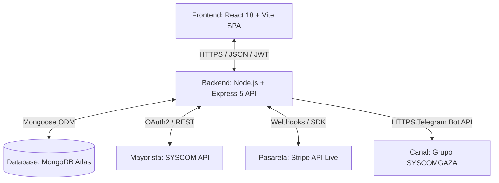

# 📘 Manual Maestro Integral del Sistema GAZA E-Commerce
**Documento Unificado de Arquitectura, Operaciones, Finanzas, Logística y Despliegue**  
*Plataforma Oficial: `syscomgaza.com` | GAZA Infraestructura TI*

---

## 📑 Tabla de Contenidos
1. [🏢 Visión General y Modelo de Negocio](#1--visión-general-y-modelo-de-negocio)
2. [📐 Arquitectura Técnica y Stack Tecnológico](#2--arquitectura-técnica-y-stack-tecnológico)
3. [📦 Catálogo, Sincronización y Sanitización de Productos](#3--catálogo-sincronización-y-sanitización-de-productos)
4. [💰 Política de Precios, Márgenes y Reglas de Envío](#4--política-de-precios-márgenes-y-reglas-de-envío)
5. [💳 Pasarela de Pagos Stripe y Análisis Financiero](#5--pasarela-de-pagos-stripe-y-análisis-financiero)
6. [🏦 Transferencias Bancarias Directas (SPEI) y Protocolo de Validación](#6--transferencias-bancarias-directas-spei-y-protocolo-de-validación)
7. [🚚 Operaciones, Logística y Fulfillment con SYSCOM](#7--operaciones-logística-y-fulfillment-con-syscom)
8. [🔒 Seguridad, Autenticación y Control de Roles](#8--seguridad-autenticación-y-control-de-roles)
9. [🚀 Guía de Despliegue en Servidores AWS](#9--guía-de-despliegue-en-servidores-aws)
10. [📚 Directorio de Archivos y Contacto Oficial](#10--directorio-de-archivos-y-contacto-oficial)

---

## 1. 🏢 Visión General y Modelo de Negocio

La plataforma **GAZA Infraestructura TI** (`syscomgaza.com`) opera como el intermediario comercial y tecnológico de valor agregado entre el mayorista de tecnología líder en México (**SYSCOM**) y el **Cliente Final** (empresas, integradores, instituciones y consumidores finales).

```
┌───────────────────────────┐      ┌───────────────────────────┐      ┌───────────────────────────┐
│        1. SYSCOM          │ ───► │         2. GAZA           │ ───► │     3. CLIENTE FINAL      │
│   (Mayorista / Almacén)   │      │ (Intermediario / Etiqueta)│      │  (Comprador / Destino)    │
└───────────────────────────┘      └───────────────────────────┘      └───────────────────────────┘
```

### Principios Fundamentales del Negocio:
1. **Catálogo Mayorista en Tiempo Real:** Los productos se sincronizan directamente con los almacenes de SYSCOM, reflejando existencias y precios actualizados.
2. **Utilidad Comercial Dinámica:** Se aplica un margen estructurado (**10% en redes/IT** y **12% en videovigilancia y demás categorías**) sobre el costo mayorista en MXN.
3. **Identidad de Marca GAZA:** Todo paquete despachado lleva la **Etiqueta Oficial de Envío GAZA** con remitente corporativo y folio de rastreo.
4. **Cero Despacho sin Fondos Reales:** Ningún pedido se procesa ante SYSCOM hasta que el pago figure como `Aprobado` (Stripe) o verificado en la cuenta bancaria de GAZA (SPEI).

---

## 2. 📐 Arquitectura Técnica y Stack Tecnológico

El sistema implementa una arquitectura desacoplada y modular orientada a servicios:



### Capas del Ecosistema:
* **Frontend (React 18 + Vite):**
  - SPA responsiva con Bootstrap 5, diseño *Royal Navy* (`#1e3a8a`, `#2563eb`), animaciones suaves y controles de cantidad (+ / -) de alto contraste.
  - Enrutamiento dual mediante React Router: rutas en español e inglés (`/producto/:productId` y `/product/:productId`, `/tienda`, `/ofertas`, `/mi-cuenta`, `/cart`, `/checkout`, `/admin`).
* **Backend (Node.js + Express 5):**
  - Controladores modulares, middlewares de validación con Zod y autorización con JWT.
  - SRE Cache en memoria para catálogo (TTL 15s) que reduce la latencia en más del 80%.
* **Persistencia (MongoDB Atlas + Mongoose):**
  - Modelos optimizados: `User`, `Product`, `Order`, `WebhookLog`.
* **Notificaciones en Tiempo Real:**
  - Bot de Telegram corporativo (`@SystiGBot`) conectado al grupo `SYSCOMGAZA` (`chat_id: -5326017751`).
  - Emails automáticos a clientes y copia administrativa a `syscom.gaza.ma9@gmail.com`.

---

## 3. 📦 Catálogo, Sincronización y Sanitización de Productos

### 3.1 Normalización y Sanitización de Identificadores
Para asegurar navegación fluida desde el carrito, ofertas o enlaces directos, el backend (`productController.js`) implementa sanitización inteligente:
- Si el cliente o el carrito ingresa un ID con prefijo sintético (ej. `syscom-226411`), el controlador extrae `cleanId = "226411"`.
- Busca de forma resiliente por `_id` de Mongo, `syscomId` y `model`.
- Si el producto aún no existe en la base de datos local, consulta la API de SYSCOM con `cleanId` y lo sincroniza al vuelo (`syscomService.syncProduct`).

### 3.2 Categorías y Mapeo Inteligente
El catálogo clasifica los productos en 6 grandes áreas tecnológicas:
1. **Videovigilancia:** Cámaras IP, DVRs, NVRs, domos, PTZ.
2. **Redes e IT:** Switches, routers, access points, fibra óptica, gabinetes, cableado UTP.
3. **Control de Acceso:** Biométricos, cerraduras magnéticas, torniquetes, tarjetas RFID.
4. **Energía y Herramientas:** No-breaks (UPS), fuentes de poder, baterías, paneles solares.
5. **Automatización:** Alarmas, sensores de intrusión, sirenas, domótica.
6. **IoT y GPS:** Localizadores satelitales, telemetría y sensores inteligentes.

---

## 4. 💰 Política de Precios, Márgenes y Reglas de Envío

Toda la lógica financiera opera bajo las siguientes fórmulas matemáticas oficiales:

### Fórmulas del Sistema:
$$\text{Margen de Utilidad} = \begin{cases} 10\% & \text{si Categoría es Redes / IT} \\ 12\% & \text{si Categoría es Videovigilancia, Automatización u Otras} \end{cases}$$

$$\text{Costo Mayorista MXN} = \text{Precio USD SYSCOM} \times \text{Tipo de Cambio}$$

$$\text{Precio Neto GAZA} = \text{Costo Mayorista MXN} \times (1 + \text{Margen})$$

$$\text{IVA 16\%} = \text{Subtotal Neto} \times 0.16$$

$$\text{Costo de Envío} = \begin{cases} \$0.00 \text{ MXN (GRATIS)} & \text{si Subtotal Neto } \ge \$2,499.00 \text{ MXN} \\ \$185.00 \text{ MXN} & \text{si Subtotal Neto } < \$2,499.00 \text{ MXN} \end{cases}$$

$$\mathbf{\text{Total Cobrado al Cliente}} = \text{Subtotal Neto} + \text{IVA (16\%)} + \text{Costo de Envío}$$

> ⚠️ **Regla Crítica del Envío Gratis:** El umbral de **$2,499.00 MXN** se evalúa **estrictamente sobre el subtotal neto de los productos (antes de IVA)**. Esto evita que el impuesto active indebidamente la promoción si el cliente aún no alcanza la meta en artículos.

---

## 5. 💳 Pasarela de Pagos Stripe y Análisis Financiero

### 5.1 Estructura de Comisiones en México
Stripe procesa tarjetas de crédito y débito (Visa, Mastercard, AMEX, Carnet) bajo la tarifa oficial:
$$\mathbf{3.6\% + \$3.00\text{ MXN}} \ (+ 16\% \text{ de IVA sobre la comisión})$$

### 5.2 Rendimiento Neto y Retención por Venta
| Total Cobrado | Retención Total Stripe | Depósito a Cuenta GAZA | Costo SYSCOM (aprox) | Utilidad Neta Limpia GAZA |
| :---: | :---: | :---: | :---: | :---: |
| **$1,000.00 MXN** | $45.24 MXN | **$954.76 MXN** | $792.00 MXN | **+$162.76 MXN** |
| **$2,500.00 MXN** | $107.88 MXN | **$2,392.12 MXN** | $1,980.00 MXN | **+$412.12 MXN** |
| **$5,000.00 MXN** | $212.28 MXN | **$4,787.72 MXN** | $3,960.00 MXN | **+$827.72 MXN** |
| **$10,000.00 MXN** | $421.08 MXN | **$9,578.92 MXN** | $7,920.00 MXN | **+$1,658.92 MXN** |

* **Deducibilidad Fiscal:** Al cierre de mes, Stripe emite el CFDI (XML/PDF) para acreditar el IVA y deducir el gasto ante el SAT.
* **Ciclo de Retiros (Payouts):** Los fondos se transfieren automáticamente a la cuenta de GAZA en un ciclo rolling de **24 a 48 horas hábiles**.

---

## 6. 🏦 Transferencias Bancarias Directas (SPEI) y Protocolo de Validación

Para compras corporativas o de alto valor, GAZA ofrece transferencias SPEI directas con **0% de comisión**:

### 6.1 Cuentas Bancarias Oficiales

#### 💳 Opción 1: Cuenta HSBC México
* **Banco:** **HSBC México**
* **Beneficiario:** **MARIO ANCIRA GALAN**
* **CLABE Interbancaria (SPEI):** `021180066305780900`
* **Tarjeta (OXXO / Farmacias del Ahorro / Ventanilla):** `4213 1660 3619 3831`
* **Referencia / Concepto:** Folio único de la orden (ej. `ORD-1772412891`)

#### 💳 Opción 2: Cuenta Santander México
* **Banco:** **Santander México**
* **Beneficiaria:** **F Irene Galán Sanchez**
* **CLABE Interbancaria (SPEI):** `014180606242660987`
* **Tarjeta (OXXO / Ventanilla):** `5579 0701 6216 2195`
* **Referencia / Concepto:** Folio único de la orden (ej. `ORD-1772412891`)

### 6.2 Protocolo de Validación en el Panel `/admin`
1. **Recepción del Comprobante:** El cliente envía comprobante a `syscom.gaza.ma9@gmail.com` o WhatsApp con su folio `ORD-XXXXX`.
2. **Cotejo en App Bancaria:** El administrador abre la aplicación de **HSBC** o **Santander** y constata que los fondos reales ingresaron.
3. **Aprobación en 1 Clic:** En `syscomgaza.com/admin` $\rightarrow$ pestaña **Órdenes** $\rightarrow$ **Ver Detalle** $\rightarrow$ botón verde **`✓ Aprobar pago y procesar`**.
4. **Rechazo por Inconsistencia:** Si transcurren 24 horas sin pago o el comprobante no coincide, se presiona **`Rechazar Pago`** para liberar el stock.

---

## 7. 🚚 Operaciones, Logística y Fulfillment con SYSCOM

### 7.1 Las 5 Fases del Ciclo de Orden
1. **Fase 1 (`supplier_received`):** SYSCOM recibe la solicitud de surtido.
2. **Fase 2 (`in_transit`):** Producto en tránsito desde bodega SYSCOM hacia GAZA.
3. **Fase 3 (`intermediary_processing`):** Inspección de número de serie y colocado de la **Etiqueta Oficial GAZA**.
4. **Fase 4 (`out_for_delivery`):** Despacho final al cliente con guía asignada y correo de rastreo.
5. **Fase 5 (`delivered`):** Entrega completada y firmada por el destinatario.

### 7.2 Herramientas del Panel de Administración
* **Botón "📋 Copiar Dirección":** Genera bloque de texto estándar listo para pegar en el portal de SYSCOM o paquetería.
* **Botón "🖨️ Imprimir Etiqueta GAZA":** Genera formato térmico adhesivo con remitente corporativo `syscom.gaza.ma9@gmail.com`, datos destacados del destinatario, ficha de contenido y código de barras.

---

## 8. 🔒 Seguridad, Autenticación y Control de Roles

1. **Rotación de Refresh Tokens (RTR):** Previene robo de sesión mediante tokens de corta duración (15 min) y refresh tokens con hashing y detección de reuso.
2. **Control de Acceso Basado en Roles (RBAC):** Separación estricta entre rol `user` y rol `admin`.
3. **Idempotencia en Webhooks:** Modelo `WebhookLog` que evita duplicidad de cobros ante reintentos de red de Stripe.
4. **Cifrado de Contraseñas:** `bcryptjs` con 10 salt rounds.

---

## 9. 🚀 Guía de Despliegue en Servidores AWS

### 9.1 Política de Ramas Git
- **Ramas de Desarrollo y Despliegue:** `Jerzain`, `Rotsen`, y `continuacion-ElAmoDeLasWaifus`.
- **Restricción Estricta:** La rama `main` **no debe recibir pushes directos**.

### 9.2 Ejecución de Actualización en AWS EC2 / Lightsail
```bash
# Conectarse vía SSH a la instancia y ejecutar:
bash deploy.sh Jerzain
```

El script `deploy.sh`:
1. Hace pull de los últimos commits de `Jerzain`.
2. Compila el frontend en `dist/` con `npm run build`.
3. Sincroniza los archivos estáticos en Nginx.
4. Reinicia la API en PM2 con zero-downtime (`pm2 restart gaza-backend`).

---

## 10. 📚 Directorio de Archivos y Contacto Oficial

| Documento | Enlace | Propósito |
| :--- | :--- | :--- |
| **Manual Maestro Integral** | [`docs/MANUAL_MAESTRO_INTEGRAL_SISTEMA_GAZA.md`](MANUAL_MAESTRO_INTEGRAL_SISTEMA_GAZA.md) | Este documento unificado. |
| **Manual Operativo y Ventas** | [`docs/MANUAL_OPERATIVO_VENTAS_Y_FULFILLMENT.md`](MANUAL_OPERATIVO_VENTAS_Y_FULFILLMENT.md) | Guía detallada de fulfillment y logística. |
| **Manual Pasarela Stripe** | [`docs/MANUAL_PASARELA_STRIPE_Y_FINANZAS.md`](MANUAL_PASARELA_STRIPE_Y_FINANZAS.md) | Finanzas, comisiones y conciliación. |
| **Manual SPEI Bancario** | [`docs/MANUAL_TRANSFERENCIAS_BANCARIAS_SPEI.md`](MANUAL_TRANSFERENCIAS_BANCARIAS_SPEI.md) | Cuentas bancarias y aprobación manual. |
| **Manual Técnico** | [`docs/MANUAL_TECNICO.md`](MANUAL_TECNICO.md) | Arquitectura de software y base de datos. |
| **Guía de Despliegue AWS** | [`docs/GUIA_DESPLIEGUE.md`](GUIA_DESPLIEGUE.md) | Configuración de servidor, Nginx y PM2. |
| **Checklist Producción** | [`docs/CHECKLIST_CIERRE_PRODUCCION.md`](CHECKLIST_CIERRE_PRODUCCION.md) | Auditoría de lanzamiento. |

* **Correo Oficial de Soporte y Operaciones:** `syscom.gaza.ma9@gmail.com`
* **Dominio Oficial:** [https://syscomgaza.com](https://syscomgaza.com)
