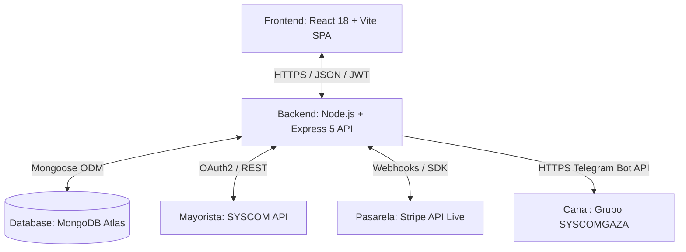

# Manual Técnico de Arquitectura del Sistema GAZA E-Commerce

Este manual técnico detalla la arquitectura de software, el modelo de datos, la integración con proveedores, la pasarela de pagos, las notificaciones en tiempo real y el esquema de seguridad del **Sistema GAZA Infraestructura TI** (`syscomgaza.com`), desarrollado con estándares de producción y ciberseguridad empresarial.

---

## 1. Arquitectura General del Sistema

El sistema utiliza una arquitectura desacoplada basada en el patrón de diseño Cliente-Servidor con comunicación a través de una API RESTful:



### Componentes de la Arquitectura:

1. **Frontend (Capa de Presentación):** 
   - Desarrollado como una aplicación de página única (SPA) con **React 18** y empaquetado ultra-rápido por **Vite**.
   - **Enrutamiento:** React Router soportando rutas en español e inglés (`/producto/:productId` y `/product/:productId`, `/tienda`, `/ofertas`, `/mi-cuenta`, `/cart`, `/checkout`, `/admin`).
   - **Diseño Visual:** Paleta corporativa *Royal Navy / Dark Sapphire* (`#1e3a8a`, `#2563eb`), diseño responsivo en Bootstrap 5, tarjetas con desenfoque de cristal (Glassmorphism) y controles de cantidad de alto contraste.
   - **Gestión de Estado:** Hooks especializados (`useCartHooks`, `useAuthHooks`) y `localStorage` persistente para sesión y carrito.

2. **Backend (Capa de Lógica de Negocio):**
   - API REST construida sobre **Node.js** con **Express 5**.
   - Arquitectura en capas: Rutas $\rightarrow$ Middlewares de Validación (Zod) y Autorización (JWT) $\rightarrow$ Controladores $\rightarrow$ Capa de Servicios $\rightarrow$ Modelos Mongoose.
   - **Sanitización de IDs:** Controlador `productController.js` limpia automáticamente prefijos como `syscom-226411` a `226411` para buscar en MongoDB o consultar la API de SYSCOM en tiempo real.

3. **Capa de Base de Datos (Persistencia):**
   - Base de datos NoSQL **MongoDB Atlas** en la nube, operada mediante el ODM **Mongoose**.

4. **Integraciones Externas:**
   - **SYSCOM API:** Sincronización de catálogo, stock en vivo, cálculo de margen por categoría (10% en redes-it y 12% en videovigilancia y otros) y tipo de cambio interbancario USD/MXN.
   - **Stripe API (Live):** Procesamiento de tarjetas bancarias con autenticación 3D Secure y Webhooks de idempotencia (`WebhookLog`).
   - **Telegram Bot API:** Alertas instantáneas de ventas y depósitos dirigidas al grupo corporativo **`SYSCOMGAZA`**.

---

## 2. Modelos y Estructura de Datos (MongoDB)

### 2.1 Modelo de Usuario (`User`)
Almacena la identidad, credenciales y sesiones para la rotación segura de tokens (RTR):
- `name` (String, requerido): Nombre completo del cliente o administrador.
- `email` (String, requerido, único, indexado): Correo electrónico.
- `password` (String, requerido): Hash seguro generado con `bcryptjs` (salt rounds = 10).
- `role` (String, enum: `['user', 'admin']`, default: `'user'`).
- `savedShippingAddress` (Object): Dirección predeterminada para autocompletar checkout.
- `refreshTokens` (Array): Lista de sesiones con `tokenHash`, `sessionId`, `expiresAt` y `revokedAt`.

### 2.2 Modelo de Producto (`Product`)
- `name` (String): Título comercial del producto.
- `price` (Number): Precio neto en MXN con el **margen de ganancia dinámico (10% - 12%)** de GAZA aplicado.
- `listPrice` (Number): Precio de lista sugerido para anclaje de descuento y ahorro.
- `category` (String): Categoría normalizada (`videovigilancia`, `redes-it`, `control-acceso`, etc.).
- `stock` (Number): Existencias disponibles en tiempo real.
- `syscomId` (String, indexado): ID único asignado por el catálogo mayorista de SYSCOM.
- `brand` / `model` / `image`: Metadatos del fabricante e imagen oficial.

### 2.3 Modelo de Orden (`Order`)
- `user` (ObjectId $\rightarrow$ `User`): Comprador.
- `orderNumber` (String, único): Código identificador legible (ej. `ORD-654321`).
- `products` (Array): Elementos comprados (`productId`, `name`, `price`, `quantity`).
- `shippingAddress` (Object): Calle, número exterior/interior, colonia, CP, municipio, estado y referencias.
- `subtotal` (Number): Suma neta de productos.
- `tax` (Number): **IVA (16% México)** desglosado.
- `shippingCost` (Number): Flete ($0 si subtotal $\ge \$2,499$ MXN neto antes de IVA, o $185 MXN en compras menores).
- `totalPrice` (Number): Monto final cobrado al cliente.
- `paymentInfo` (Object): Método (`credit_card`, `bank_transfer`), proveedor (`stripe`, `hsbc`, `santander`).
- `paymentStatus` (String): `'pending_validation'` (SPEI) | `'approved'` (Stripe o SPEI validado) | `'rejected'`.
- `status` (String): `'pending'` | `'processing'` | `'in_transit'` | `'delivered'` | `'cancelled'`.

### 2.4 Modelo de Registro de Webhooks (`WebhookLog`)
- `eventId` (String, único, indexado): Identificador de evento de Stripe para garantizar **idempotencia total** y prevenir duplicación de cobros o despachos.

---

## 3. Lógica de Precios, Impuestos y Envíos

Toda la lógica de precios se encuentra centralizada en [backend/src/config/currency.js](file:///c:/Users/Radic/OneDrive/Escritorio/SS/Gaza-Continue-clean/backend/src/config/currency.js) y [frontend/src/hooks/useCartHooks.js](file:///c:/Users/Radic/OneDrive/Escritorio/SS/Gaza-Continue-clean/frontend/src/hooks/useCartHooks.js):

$$\text{Margen por Categoría} = \begin{cases} 10\% & \text{si Categoría es Redes / IT} \\ 12\% & \text{si Categoría es Videovigilancia, Automatización u Otras} \end{cases}$$
$$\text{Costo Mayorista MXN} = \text{Precio USD SYSCOM} \times \text{Tipo de Cambio}$$
$$\text{Precio Neto GAZA} = \text{Costo Mayorista MXN} \times (1 + \text{Margen})$$
$$\text{IVA 16\%} = \text{Subtotal Neto} \times 0.16$$
$$\text{Envío} = \begin{cases} \$0.00 \text{ MXN (GRATIS)} & \text{si Subtotal Neto } \ge \$2,499.00 \text{ MXN} \\ \$185.00 \text{ MXN} & \text{si Subtotal Neto } < \$2,499.00 \text{ MXN} \end{cases}$$
$$\text{Total Cobrado} = \text{Subtotal Neto} + \text{IVA (16\%)} + \text{Envío}$$

---

## 4. Servicio de Notificaciones Push (`notificationService.js`)

Al confirmarse una orden (vía Stripe Webhook o por aprobación manual de SPEI en `/admin`), el backend dispara en paralelo:
1. **Alerta a Telegram Bot (`@SystiGBot`):**  
   Envía un mensaje enriquecido con HTML al grupo corporativo **`SYSCOMGAZA`** (`chat_id: -5326017751`) con número de orden, cliente, productos, total cobrado y método de pago.
2. **Notificación por Email:**  
   Envía el comprobante y resumen al correo administrativo `syscom.gaza.ma9@gmail.com` y al correo del cliente.

---

## 5. Estrategia de Ramas y Despliegue en AWS

- **Ramas de Trabajo Autorizadas:** `Jerzain`, `Rotsen`, y `continuacion-ElAmoDeLasWaifus`.
- **Restricción Crítica:** No realizar push directo a la rama `main`.
- **Comando de Despliegue en AWS EC2:**
  ```bash
  bash deploy.sh Jerzain
  ```
