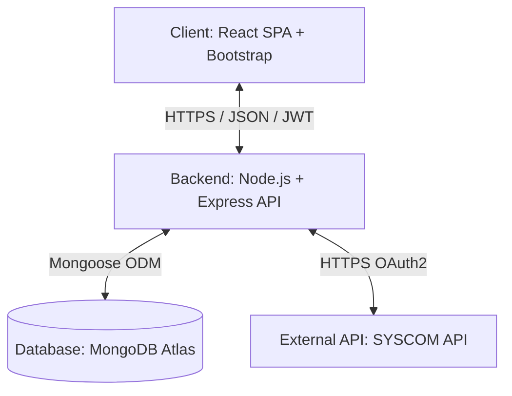
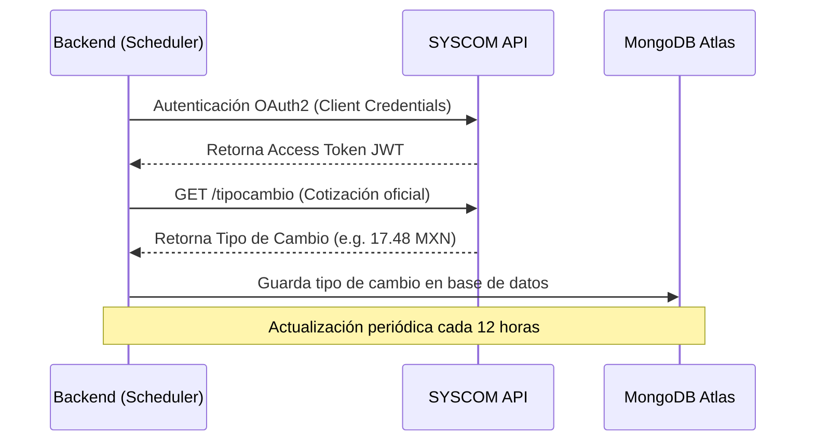

# Manual Técnico de Arquitectura del Sistema Gaza E-Commerce

Este manual técnico detalla la arquitectura de software, el modelo de datos, la integración con proveedores y el esquema de seguridad del **Sistema Gaza**, desarrollado como proyecto de titulación profesional para un e-commerce corporativo enfocado en tecnologías de videovigilancia y ciberseguridad.

---

## 1. Arquitectura General del Sistema

El sistema utiliza una arquitectura desacoplada basada en el patrón de diseño Cliente-Servidor con comunicación a través de una API RESTful:

### Componentes de la Arquitectura:

1. **Frontend (Capa de Presentación):** 
   - Desarrollado como una aplicación de página única (SPA) con **React** y empaquetado ultra-rápido por **Vite**.
   - **Estilos:** Bootstrap para la estructura adaptativa, combinado con CSS modular nativo para aplicar el diseño *Cyberpunk/Ciberseguridad* premium (Glassmorphism, gradientes radiales, sombras resplandecientes).
   - **Gestión de Estado:** Hooks de React (`useState`, `useEffect`) y Contexts para el estado del carrito de compras.

2. **Backend (Capa de Lógica de Negocio):**
   - Una API REST robusta construida sobre **Node.js** con el framework de enrutamiento **Express**.
   - Implementa un patrón MVC donde los enrutadores delegan a controladores dedicados y los modelos interactúan con la base de datos.

3. **Capa de Base de Datos (Persistencia):**
   - Base de datos NoSQL **MongoDB Atlas** alojada en la nube, operada mediante el Modelado de Objetos (ODM) de **Mongoose**.

4. **Integración Externa (SYSCOM API):**
   - Módulo cliente dedicado que sincroniza de forma segura y en tiempo real el inventario, catálogo, marcas y precios en pesos mexicanos (MXN) a partir de los dólares estadounidenses (USD) de la API original.

---

## 2. Modelos y Estructura de Datos (MongoDB)

### 2.1 Modelo de Usuario (`User`)
Almacena la información de autenticación, roles de acceso y las sesiones de tokens de actualización (Refresh Tokens) para asegurar la persistencia y revocación de accesos.

- **Atributos:**
  - `name` (String, requerido): Nombre completo.
  - `email` (String, requerido, único, indexado): Correo electrónico (identificador principal).
  - `password` (String, requerido): Hash bcrypt de la contraseña.
  - `role` (String, default: `'user'`): Rol de acceso (`'user'` | `'admin'`).
  - `isBlocked` (Boolean, default: `false`): Bandera para suspender accesos.
  - `savedShippingAddress` (Object): Dirección predeterminada de envío (calle, número, colonia, código postal, ciudad, estado).
  - `refreshTokens` (Array de Objetos): Sesiones activas de tokens. Cada sesión contiene:
    - `tokenHash` (String): Hash SHA-256 del token para validación segura.
    - `sessionId` (UUID): Identificador único de sesión.
    - `createdAt` (Date): Fecha de emisión.
    - `expiresAt` (Date): Expiración del token.
    - `revokedAt` (Date): Fecha de revocación manual (logout).
    - `replacedByHash` (String): Hash del token que reemplazó a este en la rotación.

### 2.2 Modelo de Producto (`Product`)
Contiene los productos de seguridad electrónica importados de SYSCOM o creados localmente.

- **Atributos:**
  - `name` (String, requerido): Nombre del producto.
  - `price` (Number, requerido): Precio final en pesos mexicanos (MXN).
  - `description` (String): Descripción técnica detallada.
  - `category` (String, requerido): Categoría (por ejemplo, `cctv`, `redes`, `energia-herramientas`).
  - `image` (String): URL de la imagen en los servidores de SYSCOM.
  - `stock` (Number, default: `0`): Cantidad física en existencia.
  - `syscomId` (String, único, opcional): ID del producto original en la plataforma de SYSCOM.
  - `brand` (String): Marca fabricante (por ejemplo, Hikvision, Epcom).
  - `active` (Boolean, default: `true`): Estado de visibilidad en el catálogo.

### 2.3 Modelo de Orden (`Order`)
Registra las compras realizadas, la dirección de envío y los estados del ciclo de validación de pago.

- **Atributos:**
  - `user` (ObjectId, referencia a `User`): Cliente que realizó el pedido.
  - `products` (Array): Lista de productos y cantidades de la orden.
  - `shippingAddress` (Object): Dirección física completa de entrega del paquete.
  - `paymentInfo` (Object): Información del método de pago (`method: 'bank_transfer'`, comprobante).
  - `status` (String, default: `'pending'`): Estado de envío (`'pending'` | `'processing'` | `'shipped'` | `'delivered'` | `'cancelled'`).
  - `paymentStatus` (String, default: `'pending_bank_validation'`): Control de verificación manual de fondos (`'pending_bank_validation'` | `'paid'` | `'failed'`).
  - `totalPrice` (Number, requerido): Total cobrado en MXN.
  - `shippingCost` (Number, default: `0`): Costo de envío aplicado.

---

## 3. Motor de Integración de la API de SYSCOM

El backend del sistema actúa como un cliente intermediario inteligente (Middleware) de la API de SYSCOM. Esto evita que el frontend exponga claves sensibles y reduce los consumos de red.

### 3.1 Tipo de Cambio Dinámico
- Al iniciar el servidor y posteriormente cada **12 horas**, el backend ejecuta un scheduler automático ([syscomService.js](file:///C:/Users/Radic/OneDrive/Escritorio/SS/Gaza-Continue-clean/backend/src/services/syscomService.js)).
- Llama al endpoint `/tipocambio` de SYSCOM para obtener el valor del dólar interbancario del día.
- Guarda la cotización en memoria y en base de datos para realizar conversiones instantáneas sin retrasar la carga del catálogo.

### 3.2 Conversión y Estandarización (`transformSyscomProduct`)
Para que el frontend reciba datos consistentes, el backend normaliza los campos de SYSCOM:
- Convierte el precio original en dólares (USD) a pesos mexicanos (MXN) multiplicándolo por la cotización del día.
- Mapea las categorías complejas de SYSCOM a las categorías simplificadas del catálogo local (`cctv`, `redes`, `energia-herramientas`).
- Agrega un margen de ganancia configurable antes de entregar el resultado al cliente final.

---

## 4. Esquema de Autenticación y Seguridad

Para garantizar un estándar de titulación en ciberseguridad, la autenticación implementa **Rotación de Refresh Tokens (RTR)** y **JWT efímeros**:

### 4.1 Ciclo de Vida de los Tokens
1. **Access Token (JWT):**
   - Corto tiempo de vida (15 minutos).
   - Firmado con `JWT_SECRET`.
   - Viaja en la cabecera HTTP `Authorization: Bearer <Token>`.
   - Contiene la identidad básica del usuario (`id`, `email`, `role`).
2. **Refresh Token (JWT):**
   - Tiempo de vida largo (30 días).
   - Firmado con `JWT_REFRESH_SECRET`.
   - Permite solicitar un nuevo Access Token al expirar el primero sin obligar al usuario a iniciar sesión de nuevo.

### 4.2 Rotación de Tokens (RTR) y Mitigación de Robo
- Cada vez que el frontend solicita renovar su sesión (`POST /api/auth/refresh`), el backend invalida el Refresh Token anterior y genera una pareja de tokens completamente nueva.
- Si un atacante intercepta un Refresh Token viejo e intenta usarlo:
  - El backend detecta que el token ya ha sido revocado o que su hash no corresponde al activo de la sesión.
  - El sistema asume que la sesión ha sido vulnerada y **cancela inmediatamente todas las sesiones de Refresh Tokens** registradas para ese usuario en la base de datos, forzándolo a reautenticarse por completo.

---

## 5. Scripts de Diagnóstico y Herramientas
El sistema incluye scripts listos para ejecutar diagnósticos rápidos del backend, ubicados en [backend/scripts/diagnostics/](file:///C:/Users/Radic/OneDrive/Escritorio/SS/Gaza-Continue-clean/backend/scripts/diagnostics):

- `dns-fix.js`: Fuerza a Node.js a utilizar servidores DNS públicos (Google y Cloudflare) para resolver la conexión a MongoDB Atlas en redes locales que bloquean los resolvedores por defecto.
- `test-single-sync.js`: Realiza un flujo simulado completo de sincronización de un artículo Hikvision real desde la API de SYSCOM a MongoDB Atlas para comprobar credenciales y conectividad de red.
